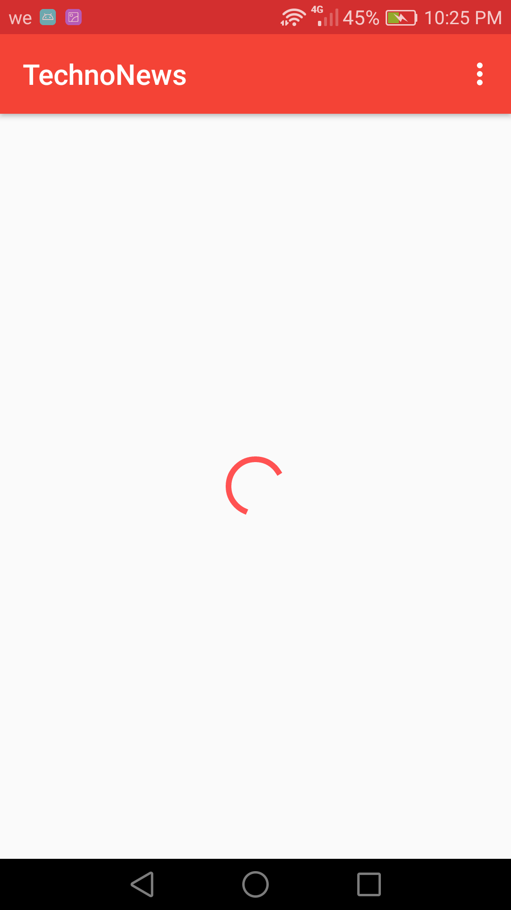
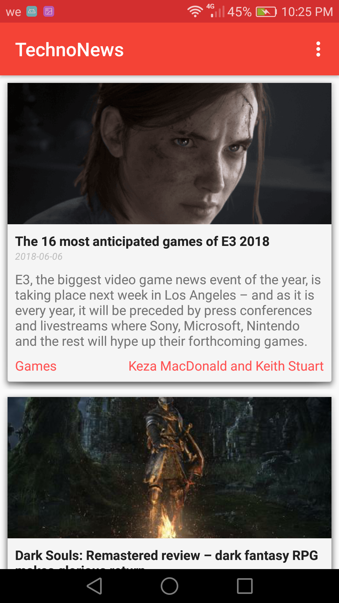
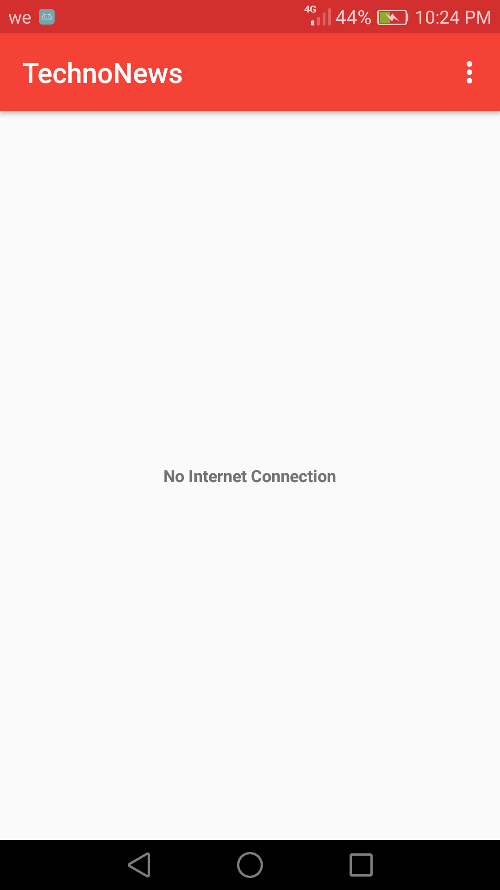
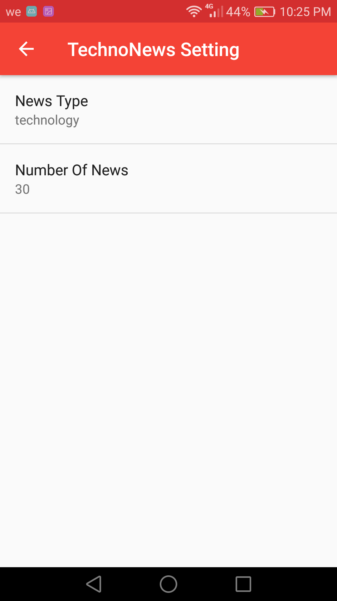
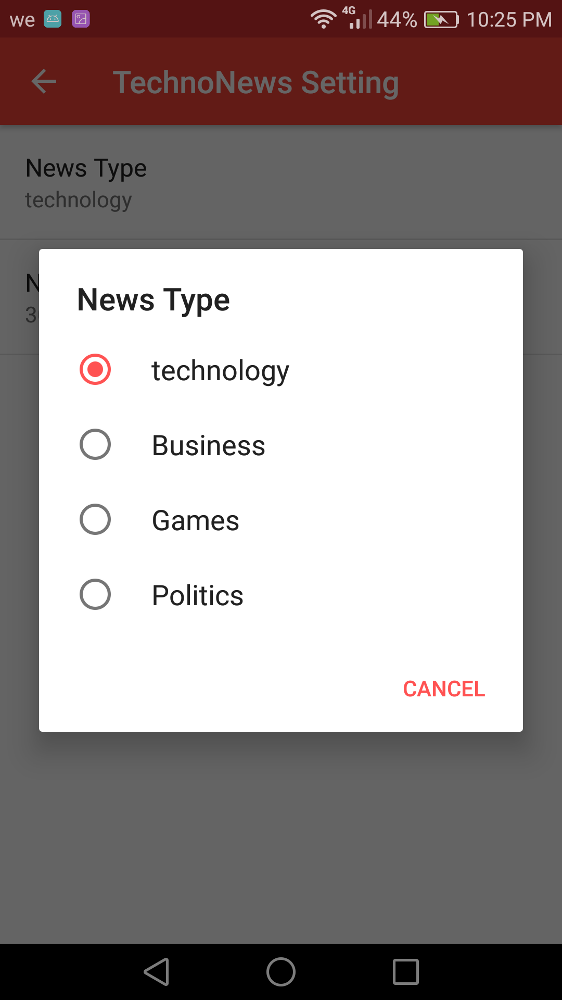

# TechnoNews Android APP
News APP cover varity of topics like games, politics.... ETC  
The main focus on this APP is showing my apility to do Network  
Operations, receive data from APIs, work with JSON

APP Work Flow
---------------
* At lunch app start a Loader Thread to do operation on the background
* APP start doing connection to News API
* After success of connection it receive JSon data that contain news
* APP Start pasring the JSON data to get needed informations
* The News pop app to the user everyone is happy
* User can choose types of news that he interested about from settings

Concepts Used
---------------
* Network QueryUtils (full control of netowrk operations).
* JSON Data, Parsing.
* HttpURLConnection, InputStream, urlConnection.
* StringBuilder, BufferedReader.
* ConnectivityManager, NetworkInfo.
* External APIs (GurdianAPI).
* Uris, Url, uriBuilder.
* Multi Threading , AsyncTaskLoader, Loaders.
* SharedPrefrences, Fragments.
* Android APPs LifeCycle.
* Menues, Menus LifeCycle.
* ListView, ArrayAdaptors, EmptyViews.
* Up/Back Navigation, ProgressBars.
* Explicit Intents.
* External Libraries (ButterKnife)
* APP UI Design & XML.
* Layout Best Practices (Text sizes are defined in sp, Lengths are defined in dp).
* Naming Conventions (All variables, methods, and resource IDs are descriptively named).
* Fully Customized Styles & Layouts.

Pre-requisites
--------------

- Android SDK 27
- Android Build Tools v27.1.1
- Android Support Repository

Screenshots
-------------
      

Getting Started
---------------

This app uses the Gradle build system. To build this project, use the
"gradlew build" command or use "Import Project" in Android Studio.

Contacts
-------

- Linkedin: https://www.linkedin.com/in/engmohamedosama/
- FaceBook: https://www.facebook.com/EngineerMohamedOsama
- Email: EngMohamedOsama@yandex.com

If you've found an error in this sample, please file an issue to email.

License
-------

Copyrights 2018 All Right Reserved To Eng.MohamedOsama.
